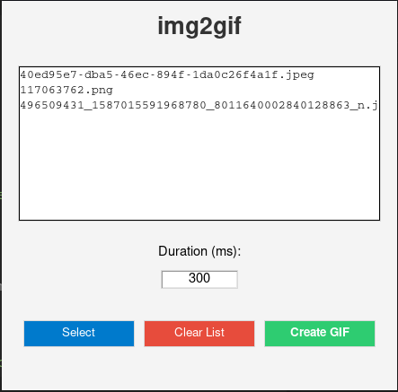

# img2gif

Python desktop application that converts multiple images into an animated GIF using **Tkinter**.

 

---

## Features

- Select multiple images (`.jpg`, `.jpeg`, `.png`)
- Customize frame duration
- Preview filenames before generating
- Clear the list anytime
- Save the final animated `.gif` file

---

## Requirements

- Python 3.x
- Pillow

Install dependencies:

```bash
pip install Pillow
